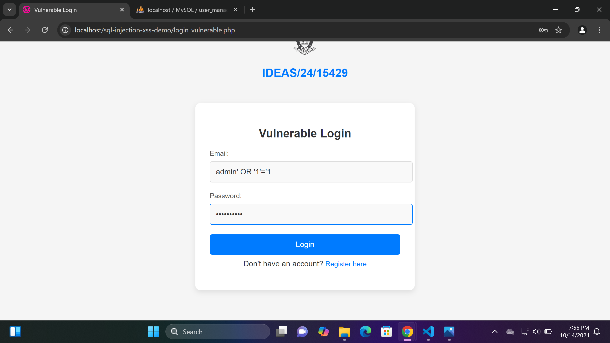
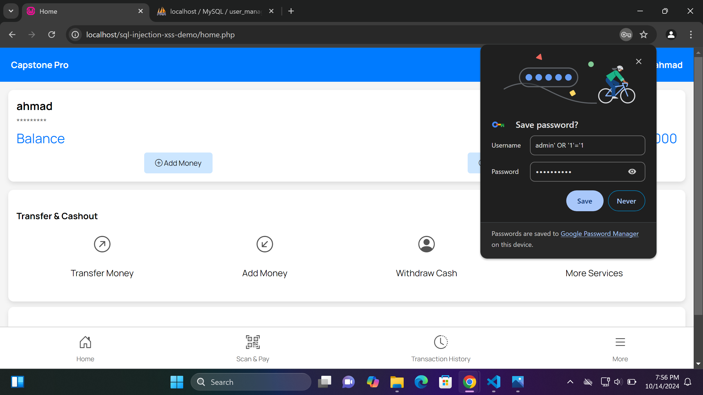
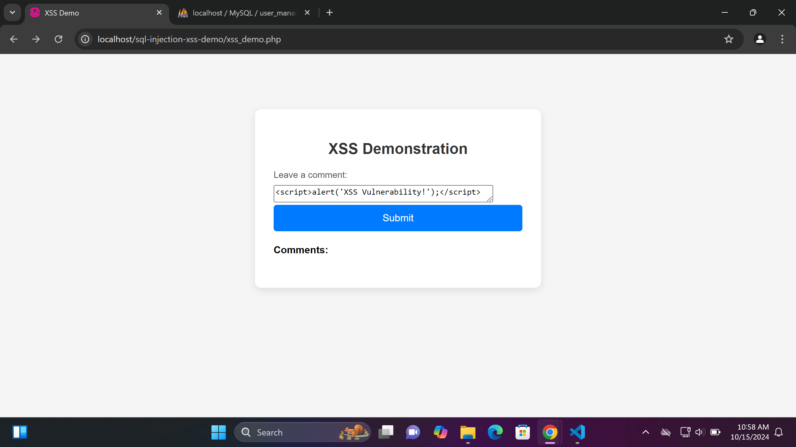
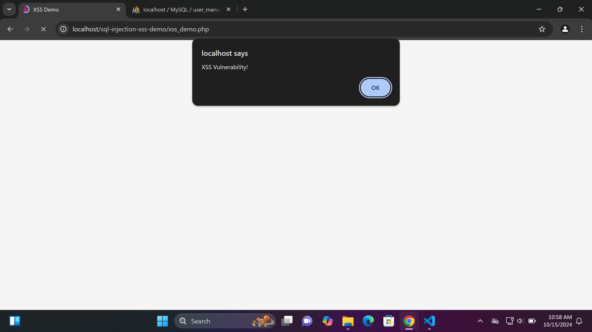
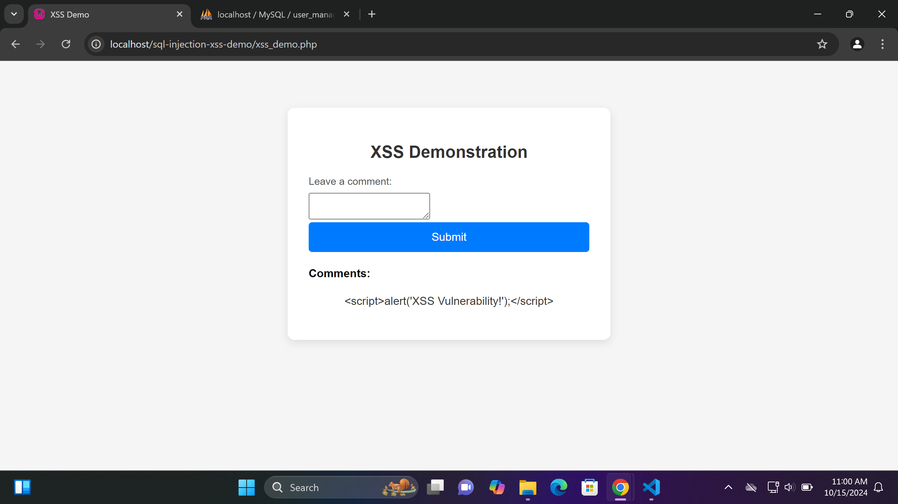

# SQL Injection and XSS Demonstration Project

## Project Overview

This project demonstrates SQL injection, Cross-Site Scripting (XSS), and secure coding practices in a simple PHP web application. The project includes vulnerabilities and their corresponding fixes to showcase the importance of security in web development.

## SQL Injection Demonstration

### Description

SQL Injection is a web security vulnerability that allows an attacker to interfere with the queries that an application makes to its database. It can allow attackers to view data that they are not normally able to retrieve, potentially allowing them to steal sensitive data. SQL injection can also be used to modify or delete data in the database, leading to unauthorized access and data corruption.

### Vulnerable Code Snippet

```php
<?php
session_start();
include 'db_connect.php'; // Include the connection file

if ($_SERVER["REQUEST_METHOD"] == "POST") {
    $email = $_POST["email"];
    $password = $_POST["password"];

    // Vulnerable version using direct SQL query (no SQL injection protection)
    $sql = "SELECT * FROM users WHERE email = '$email'";
    $result = $conn->query($sql);

    if ($result && $result->num_rows > 0) {
        $user = $result->fetch_assoc();

        // Password check bypassed for SQL injection demonstration
        if (true) {
            $_SESSION["user_id"] = $user["id"];
            $_SESSION["username"] = $user["username"];
            header("Location: profile.php");
            exit();
        }
    } else {
        echo "<p>No account found with that email.</p>";
    }
}

$conn->close();
?>
```

### Demonstration of the Attack
To demonstrate the SQL injection vulnerability, use the following payload in the email field:

admin' OR '1'='1

Expected SQL Query:

SELECT * FROM users WHERE email = 'admin' OR '1'='1'; 

This allows an attacker to bypass authentication and retrieve the first user record.

### Screenshots of the SQL Injection in Action

Screenshot 1: Login Form Before SQL Injection.
  

Screenshot 2: 

### Secure Code Snippet
Here is the secure version of the login code using prepared statements:

```php

<?php
session_start();
include 'db_connect.php'; // Include the connection file

if ($_SERVER["REQUEST_METHOD"] == "POST") {
    $email = $_POST["email"];
    $password = $_POST["password"];

    // Secure version using prepared statements
    $stmt = $conn->prepare("SELECT * FROM users WHERE email = ?");
    $stmt->bind_param("s", $email);
    $stmt->execute();
    $result = $stmt->get_result();

    if ($result->num_rows > 0) {
        $user = $result->fetch_assoc();
        if (password_verify($password, $user['password'])) {
            $_SESSION["user_id"] = $user["id"];
            $_SESSION["username"] = $user["username"];
            header("Location: profile.php");
            exit();
        } else {
            echo "<p>Invalid password.</p>";
        }
    } else {
        echo "<p>No account found with that email.</p>";
    }

    $stmt->close();
}

$conn->close();
?>


```

### Mitigation Explanation

Prepared Statements prevent SQL injection by separating the SQL logic from the data. When using prepared statements, user input is treated as data, not executable code. This means that even if an attacker tries to inject SQL code, it will not be executed as part of the SQL statement, protecting the application from unauthorized access.

## Cross-Site Scripting (XSS)

### Description

Cross-Site Scripting (XSS) is a vulnerability that allows an attacker to inject malicious scripts into webpages viewed by other users. This can lead to unauthorized actions being performed on behalf of users, session hijacking, and stealing sensitive information. XSS vulnerabilities are typically classified into three types:

- **Stored XSS**: The malicious script is stored on the server (e.g., in a database) and displayed to users who visit the page.
- **Reflected XSS**: The injected script is reflected back by the server in a response.
- **DOM-based XSS**: The vulnerability exists in the client-side code rather than server-side.

In this project, we demonstrate a **stored XSS** vulnerability using a comment form.

### Vulnerable Code Snippet

```php
<!DOCTYPE html>
<html lang="en">
<head>
    <meta charset="UTF-8">
    <meta name="viewport" content="width=device-width, initial-scale=1.0">
    <title>XSS Demo</title>
    <link rel="stylesheet" href="register.css">
</head>
<body>
    <div class="container">
        <h2>XSS Demonstration</h2>
        <form method="POST" action="xss_demo.php">
            <label for="comment">Leave a comment:</label>
            <textarea name="comment" required></textarea>
            <button type="submit">Submit</button>
        </form>

        <div class="comments-display">
            <h4>Comments:</h4>
            <?php
            if ($_SERVER["REQUEST_METHOD"] == "POST") {
                $comment = $_POST["comment"];
                // Displaying the comment without sanitization (to show XSS vulnerability)
                echo "<p>" . $comment . "</p>";
            }
            ?>
        </div>
    </div>
</body>
</html>
```

### Demonstration of the Attack

To demonstrate the XSS vulnerability, use the following payload in the comment field:

<script>alert('XSS Vulnerability!');</script>

When the form is submitted, the malicious script will execute, triggering an alert that reads "XSS Vulnerability!"

### Screenshots of the XSS Demonstration

Screenshot 1: XSS Demo Form Before Injection.


Screenshot 2: Alert Triggered by XSS Injection.



### Secure Code Snippet

To prevent XSS, update the comment display to use htmlspecialchars():

<div class="comments-display">
    <h4>Comments:</h4>
    <?php
    if ($_SERVER["REQUEST_METHOD"] == "POST") {
        $comment = $_POST["comment"];
        // Escaping the comment to prevent XSS
        echo "<p>" . htmlspecialchars($comment) . "</p>";
    }
    ?>
</div>

### Mitigation Explanation

By using htmlspecialchars(), we can prevent XSS by converting special characters in user input (such as < and >) to HTML entities (&lt; and &gt;). This way, any script tags are rendered as plain text rather than executed as HTML or JavaScript, ensuring the safety of the application from XSS attacks.

### Screenshot of secured input


# Professional Diploma In CyberSecurity (Baze-project) Product of IDEAS/24/15429 (Ahmad Abdullahi Yola)
